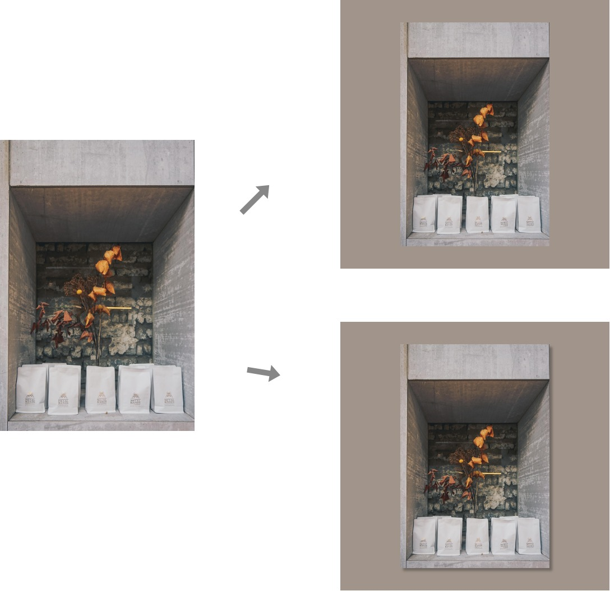

## Frame images into square with their dominant color

__Pure front-end app using FileReader Web API__

### The demand

I love to take photos in different ratio (eg. 3:4,16:9 ) in both landscape and portrait. 

But this leads to one subtle issue when I was trying to upload to social media that the images in different ratio and orientation are not prefect align. And I don't want Instagram to corp the photos to destory the original compositon. 

So, I have come up with this solution. Wrapping the photo with its dominat color looks cool (to me, at least).

### Features

It's pure front-end. 

Support multiple images upload and batch download.

Toggle the output with/without shadow beneath the image.

Can be run simply in the html file. Or I just set up a local server on port 2222.

### Sample

